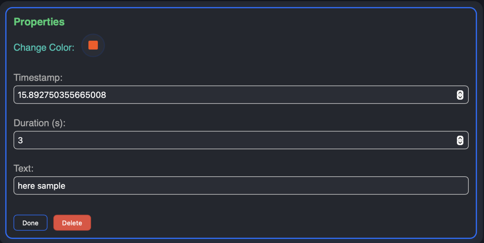

# Video Annotation Tool

A professional web-based video annotation tool that allows users to watch videos and add timestamped annotations. This project is designed for efficient video review, labeling, and collaborative feedback.

---

## 🚀 Live Demo

- **Frontend:** [https://video-annotation-tool-zd8i.vercel.app](https://video-annotation-tool-zd8i.vercel.app)
- **Backend API:** [https://video-annotation-tool.onrender.com](https://video-annotation-tool.onrender.com)

---

## 📖 Project Overview

The Video Annotation Tool enables users to:
- Play and review videos in a modern, responsive interface.
- Add, edit, and delete annotations (circle, rectangle, line, text) at specific timestamps.
- View and manage all annotations in a list.
- Edit annotation properties (color, text, etc.).
- Undo/redo annotation actions.
- Persist all annotation data in a MongoDB database.

---

## ✨ Features

- **Video Playback:** Custom video player with timeline, playback speed, and frame navigation.
- **Annotation Types:** Draw circles, rectangles, lines, and add text directly on the video.
- **Annotation List:** View all annotations with timestamp, type, and quick delete.
- **Properties Panel:** Edit color, text, and other properties for selected annotations.
- **Undo/Redo:** Easily revert or reapply annotation changes.
- **Responsive UI:** Works well on desktop and tablet screens.
- **Persistent Storage:** All data is stored in MongoDB via a RESTful API.

---

## 🛠️ Technology Stack

**Frontend:**
- [React](https://react.dev/) (with [Vite](https://vitejs.dev/))
- [Redux Toolkit](https://redux-toolkit.js.org/) for state management
- [TypeScript](https://www.typescriptlang.org/)
- [CSS-in-JS](https://emotion.sh/docs/introduction) and modern CSS
- [React Icons](https://react-icons.github.io/react-icons/)

**Backend:**
- [Node.js](https://nodejs.org/)
- [Express](https://expressjs.com/)
- [MongoDB Atlas](https://www.mongodb.com/cloud/atlas) (cloud database)
- [Mongoose](https://mongoosejs.com/)

**Deployment:**
- **Frontend:** [Vercel](https://vercel.com/)
- **Backend:** [Render](https://render.com/)

---

## 📦 API Documentation

### Base URL

```
https://video-annotation-tool.onrender.com/api/annotations
```

### Endpoints

#### 1. Get All Annotations

- **GET** `/api/annotations`
- **Query Params:** `videoId` (optional)
- **Response:**
    ```json
    [
      {
        "id": "6658c1f...",
        "type": "circle",
        "timestamp": 21,
        "x": 120,
        "y": 80,
        "width": 50,
        "height": 50,
        "color": "#0d6efd",
        "text": "",
        "duration": 3,
        "createdAt": "2024-05-30T12:34:56.789Z"
      }
    ]
    ```

#### 2. Create a New Annotation

- **POST** `/api/annotations`
- **Body:**
    ```json
    {
      "type": "rectangle",
      "timestamp": 10,
      "x": 100,
      "y": 100,
      "width": 80,
      "height": 40,
      "color": "#ff0000",
      "text": "Car",
      "duration": 3
    }
    ```
- **Response:**  
    Returns the created annotation object.

#### 3. Update an Annotation

- **PUT** `/api/annotations/:id`
- **Body:** (fields to update)
    ```json
    {
      "color": "#00ff00",
      "text": "Updated label"
    }
    ```
- **Response:**  
    Returns the updated annotation object.

#### 4. Delete an Annotation

- **DELETE** `/api/annotations/:id`
- **Response:**
    ```json
    { "success": true }
    ```

---

## 🖼️ Screenshots

### Main Video Annotation Interface


### Annotation List and Properties


### Adding and Editing Annotations



> _Screenshots are for demonstration. Please see the live demo for the latest UI._

---

## 📝 Assumptions & Design Decisions

- **Single Video:** The current version assumes a single video source. The schema supports `videoId` for future multi-video support.
- **Authentication:** Not implemented; all users can annotate.
- **Performance:** Optimized for videos up to 2 minutes and moderate annotation counts.
- **Responsiveness:** Designed for desktop and tablet use.
- **Undo/Redo:** Managed in Redux state for a smooth user experience.
- **API Security:** No authentication or rate limiting; for demo/assessment use only.

---

## 🏁 Getting Started (Local Development)

1. **Clone the repository:**
    ```bash
    git clone https://github.com/yourusername/video-annotation-tool.git
    cd video-annotation-tool
    ```

2. **Backend:**
    ```bash
    cd server
    npm install
    # Set MONGODB_URI in .env or your environment
    npm start
    ```

3. **Frontend:**
    ```bash
    cd client
    npm install
    # Set VITE_API_URL in .env
    npm run dev
    ```
---

## 📬 Contact

For questions or feedback, please open an issue or contact [jagankrishna369@gmail.com](mailto:jagankrishna369@gmail.com).

---
**Thank You and Enjoy annotating your videos!**