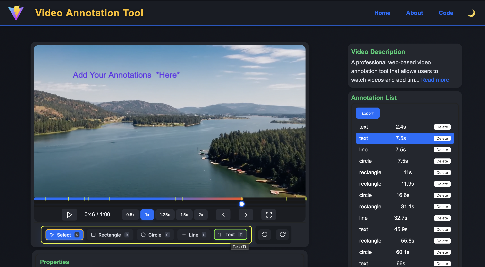

# 🎬 Video Annotation Tool

A **professional, modern web-based video annotation tool** for efficient video review, labeling, and collaborative feedback. Annotate videos with rectangles, circles, lines, and text, manage annotations with undo/redo, and export your work—all in a beautiful, responsive UI.

---

## 🚀 Live Demo

- **Frontend:** [https://video-annotation-tool-zd8i.vercel.app](https://video-annotation-tool-zd8i.vercel.app)
- **Backend API:** [https://video-annotation-tool.onrender.com](https://video-annotation-tool.onrender.com)

---

### Main Video Annotation Interface


---

## 📖 Overview

The Video Annotation Tool enables users to:
- **Play and review videos** in a modern, responsive interface.
- **Add, move, and delete annotations** (rectangle, circle, line, text) at specific timestamps.
- **Select and drag annotations** directly on the video frame.
- **Edit annotation properties** (color, text, etc.) in a dedicated panel.
- **Undo/redo** any annotation action.
- **Export annotations** as JSON.
- **Persistent storage** with a MongoDB backend.

---

## ✨ Features

- **Custom Video Player:** Timeline, playback speed, and frame navigation.
- **Annotation Types:** Rectangle, circle, line, and text—drawn directly on the video.
- **Drag-to-Move:** Select and reposition annotations with intuitive mouse actions.
- **Annotation List:** View, select, and delete annotations with timestamps and types.
- **Properties Panel:** Edit color, text, and other properties for selected annotations.
- **Undo/Redo:** Instantly revert or reapply annotation changes.
- **Export:** Download all annotations as a JSON file.
- **Responsive UI:** Optimized for desktop and tablet.
- **Persistent Storage:** All data stored in MongoDB via RESTful API.
- **Animated Timeline:** Professional, interactive seeker with annotation markers and tooltips.

---
## 💡 Innovative Idea

**Make a login page for users and store their annotations individually. Users can make friends on this platform and collaboratively annotate each other's videos and comment on them.**  
This social annotation feature would enable team collaboration, peer review, and interactive feedback on video content.

---

## 🛠️ Technology Stack

**Frontend:**
- [React](https://react.dev/) (with [Vite](https://vitejs.dev/))
- [Redux Toolkit](https://redux-toolkit.js.org/) for state management
- [TypeScript](https://www.typescriptlang.org/)
- [CSS-in-JS](https://emotion.sh/docs/introduction) and modern CSS
- [React Icons](https://react-icons.github.io/react-icons/)

**Backend:**
- [Node.js](https://nodejs.org/)
- [Express](https://expressjs.com/)
- [MongoDB Atlas](https://www.mongodb.com/cloud/atlas)
- [Mongoose](https://mongoosejs.com/)

**Deployment:**
- **Frontend:** [Vercel](https://vercel.com/)
- **Backend:** [Render](https://render.com/)

---

## 📦 API Documentation

### Base URL

```
https://video-annotation-tool.onrender.com/api/annotations
```

### Endpoints

#### 1. Get All Annotations

- **GET** `/api/annotations`
- **Query Params:** `videoId` (optional)
- **Response:**
    ```json
    [
      {
        "id": "6658c1f...",
        "type": "circle",
        "timestamp": 21,
        "x": 120,
        "y": 80,
        "width": 50,
        "height": 50,
        "color": "#0d6efd",
        "text": "",
        "duration": 3,
        "createdAt": "2024-05-30T12:34:56.789Z"
      }
    ]
    ```

#### 2. Create a New Annotation

- **POST** `/api/annotations`
- **Body:**
    ```json
    {
      "type": "rectangle",
      "timestamp": 10,
      "x": 100,
      "y": 100,
      "width": 80,
      "height": 40,
      "color": "#ff0000",
      "text": "Car",
      "duration": 3
    }
    ```
- **Response:**  
    Returns the created annotation object.

#### 3. Update an Annotation

- **PUT** `/api/annotations/:id`
- **Body:** (fields to update)
    ```json
    {
      "color": "#00ff00",
      "text": "Updated label"
    }
    ```
- **Response:**  
    Returns the updated annotation object.

#### 4. Delete an Annotation

- **DELETE** `/api/annotations/:id`
- **Response:**
    ```json
    { "success": true }
    ```

---

## 🖼️ Screenshots

### Main Video Annotation Interface



### Adding and Editing Annotations


### About Page & Documantation


### Example Edit


### Demo Video
[Watch the Video Annotation Tool in action(Demo)](https://drive.google.com/file/d/1lso127f15RivPBd9aYoNY2mSQuXr4PKS/view)

> _Screenshots are for demonstration. Please see the live demo for the latest UI Click on the URL at TOP._

---

## 📝 Assumptions & Design Decisions

- **Single Video:** The current version assumes a single video source. The schema supports `videoId` for future multi-video support.
- **Authentication:** Not implemented; all users can annotate.
- **Performance:** Optimized for videos up to 2 minutes and moderate annotation counts.
- **Responsiveness:** Designed for desktop and tablet use.
- **Undo/Redo:** Managed in Redux state for a smooth user experience.
- **API Security:** No authentication or rate limiting; for demo/assessment use only.
- **Annotation Movement:** Drag-to-move is implemented for all annotation types with accurate hit-testing.
- **UI/UX:** Timeline and annotation markers are animated for a professional look.

---

## 🏁 Getting Started (Local Development)

1. **Clone the repository:**
    ```bash
    git clone https://github.com/yourusername/video-annotation-tool.git
    cd video-annotation-tool
    ```

2. **Backend:**
    ```bash
    cd server
    npm install
    # Set MONGODB_URI in .env or your environment
    npm start
    ```

3. **Frontend:**
    ```bash
    cd client
    npm install
    # Set VITE_API_URL in .env
    npm run dev
    ```
---

## 📬 Contact

For questions or feedback, please open an issue or contact [jagankrishna369@gmail.com](mailto:jagankrishna369@gmail.com).

---

**Thank you for using the Video Annotation Tool! Enjoy annotating your videos.**